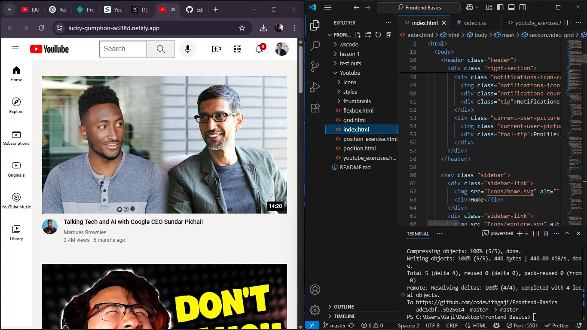

# [Youtube-Clone](https://lucky-gumption-ac20fd.netlify.app/)

A repository where I learned and practiced the fundamentals of **HTML** and **CSS**.

## 🌟 About

This repo—**Frontend Basics**—is my learning playground for HTML and CSS. Built alongside tutorials and hands‑on exercises, it covers everything from semantic markup to advanced layout techniques.

---

## 📚 What I Learned

1. **HTML Foundations**  
   - Semantic elements (`<header>`, `<footer>`, `<article>`, etc.)  
   - General elements (`
`, ``, `
`, ``, `<a>`, etc.)  
   - HTML entities and accessibility best‑practices  

2. **CSS Fundamentals**  
   - Selectors (element, class, ID, descendant, pseudo‑classes)  
   - Font families, text styling, and HTML entities in CSS  
   - Box model, margin, padding, and container (`
`) usage  

3. **Layout Techniques**  
   - Nested layouts: vertical vs. horizontal  
   - **CSS Grid** exercises (defining rows, columns, gaps, `repeat()`, `fr` units)  
   - **Flexbox** fundamentals and nested flex containers  
   - CSS positioning: `position: relative;`, `absolute;`, stacking contexts  

4. **Advanced Styling**  
   - Responsive design with media queries  
   - Mobile‑first breakpoints  
   - Styling hover states and tooltips  

## 📬 Contact
**Gaji Yaqub Ayomikun**

- GitHub: @codewithgaji

- Twitter: @codewithgaji

- Email: gajiyakub6@gmail.com
